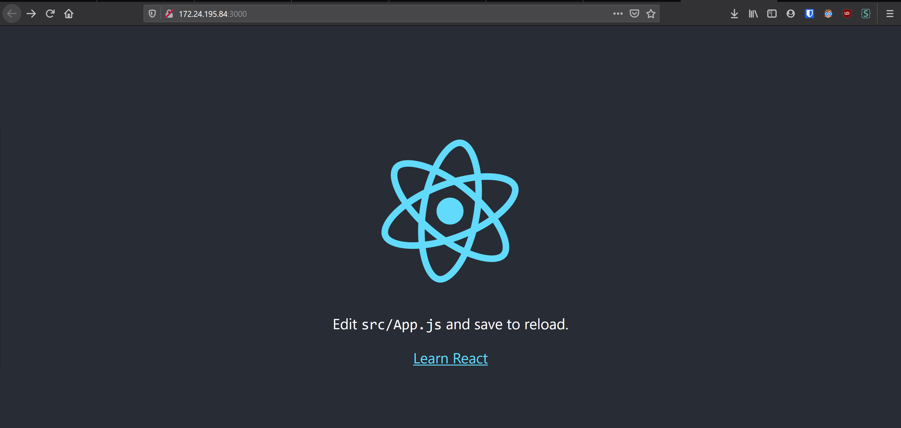

# Sample React app

Here are my notes to setup sample react app and relevant environment in WSL ubuntu.

## Install WSL

- [] Put instructions/links here for WSL, vscode etc.

## Install NVM

NVM is awesome tool to maintains node.js versions! It is similar to anaconda for python. This method is much better way of installing node that that of using apt-get. You don't need sudo permissions either.

Link to NVM: https://github.com/nvm-sh/nvm

Instructions copied from [NVM's readme](https://github.com/nvm-sh/nvm#install--update-script).

```bash
$ curl -o- https://raw.githubusercontent.com/nvm-sh/nvm/v0.36.0/install.sh | bash

  % Total    % Received % Xferd  Average Speed   Time    Time     Time  Current
                                 Dload  Upload   Total   Spent    Left  Speed
100 13527  100 13527    0     0  17988      0 --:--:-- --:--:-- --:--:-- 17964
=> Downloading nvm from git to '/home/sasank/.nvm'
=> Cloning into '/home/sasank/.nvm'...
remote: Enumerating objects: 316, done.
remote: Counting objects: 100% (316/316), done.
remote: Compressing objects: 100% (268/268), done.
remote: Total 316 (delta 36), reused 134 (delta 23), pack-reused 0
Receiving objects: 100% (316/316), 169.68 KiB | 329.00 KiB/s, done.
Resolving deltas: 100% (36/36), done.
=> Compressing and cleaning up git repository

=> Appending nvm source string to /home/sasank/.bashrc
=> Appending bash_completion source string to /home/sasank/.bashrc
=> Close and reopen your terminal to start using nvm or run the following to use it now:

export NVM_DIR="$HOME/.nvm"
[ -s "$NVM_DIR/nvm.sh" ] && \. "$NVM_DIR/nvm.sh"  # This loads nvm
[ -s "$NVM_DIR/bash_completion" ] && \. "$NVM_DIR/bash_completion"  # This loads nvm bash_completion
```

This install nvm in home directory. Open new terminal and NNM should be installed.

```bash
$ nvm list
            N/A
iojs -> N/A (default)
node -> stable (-> N/A) (default)
unstable -> N/A (default)
```

Let's install latest LTS node release.

```bash
$ nvm install --lts
Installing latest LTS version.
Downloading and installing node v12.18.4...
Downloading https://nodejs.org/dist/v12.18.4/node-v12.18.4-linux-x64.tar.xz...
########################################################################################## 100.0%
Computing checksum with sha256sum
Checksums matched!
Now using node v12.18.4 (npm v6.14.6)
Creating default alias: default -> lts/* (-> v12.18.4)
```

Let's use lts version as default node version


```bash
$ nvm use --lts
Now using node v12.18.4 (npm v6.14.6)
```

Check node's version

```bash
$ node --version
v12.18.4
```

## Create React App (CRA)

[Create React App (CRA)](https://reactjs.org/docs/create-a-new-react-app.html#create-react-app) is a light weight tool to setup barebones react app.


```bash
# this will take some time
$ npx create-react-app sample-react-app
$ cd sample-react-app
$ npm start
```

A react app should be running at http://localhost:3000 or in the url specified in the output of above command.

Development server is now setup with hot reload!

